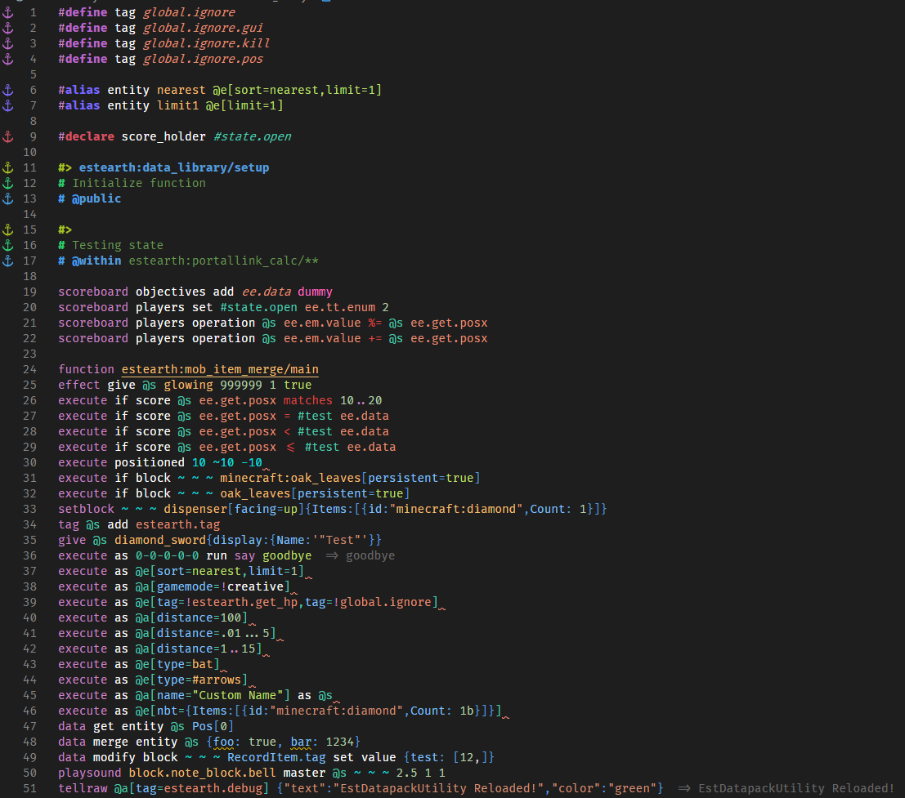

# Tooling

This tooling is recommended by me for its datapacking convenience.
## Programing

1.Install [VS Code](https://code.visualstudio.com/) or [VS Code Insider](https://code.visualstudio.com/insiders/) or [VS Codium](https://vscodium.com/) * I use Insider

2.Extensions
- [Data-pack Helper Plus](https://marketplace.visualstudio.com/items?itemName=SPGoding.datapack-language-server) various helper functionality to navigate through datapack.

Rough preview


- [language-mcfunction](https://marketplace.visualstudio.com/items?itemName=arcensoth.language-mcfunction) This extension provides a syntax highlighting more color feedback.
- [tellraw preview](https://marketplace.visualstudio.com/items?itemName=actuallyboomber.tellraw-preview) This extension provides text preview for commands that display a message to the player.


- [Comment Anchors](https://marketplace.visualstudio.com/items?itemName=ExodiusStudios.comment-anchors) Highlight comment and color mark `#` function of the `Data-pack Helper Plus`.


- [Material Icon Theme](https://marketplace.visualstudio.com/items?itemName=PKief.material-icon-theme) Change icon for pretty files. This (depends on your preference.)

## Setting

If you datapacking and want the code to look like this or customize it as you like. Can be set as follows.



0.**Color Theme**
- `Color Theme -> Select "Dark+ (default dark)"`

1.**Font**
- Font [Fira Code](https://github.com/tonsky/FiraCode) (Depending on your preference, I use this font, partly because of font ligatures `<= ->` as in the picture and `@` is cool.)
- After font download and installed, set font by going to `Setting -> Text Editor -> Font -> Font Family put Fira Code`
- Font Ligatures (change symbol `<=` `->`) -> `Edit in settings.json` -> `"editor.fontLigatures": true`

2.**Syntax Highlighting Color**
- From the previous verse, do not close the window settings.json
- You can copy and insert it (Where `,` will continue from the back `Editor.fontLigatures ": true`)
- Want to customize more [here](https://github.com/SPGoding/datapack-language-server/wiki/Semantic-Tokens)
```json
    ,
    "editor.semanticTokenColorCustomizations": {
        "enabled": true,
        "rules": {            
            "literal": "#ffffff",
            "*.firstArgument": "#c986c4",
            "*.declaration": {
                "fontStyle": "italic",
            },
            "identity": "#f1bf74",
            "operator": "#da4545",
            "boolean": "#bcdf6c",
            "property": "#81c0fa",
            "string": "#bcdf6c",
            "*.inString": {
                "fontStyle": ""
            },
            "type": "#ff6ec3",
            "variable": "#e19178",
            "vector": "#00ffffde",
        }
    },
    "workbench.colorCustomizations": {
        "statusBar.background": "#16825d",
        "statusBarItem.remoteBackground": "#3ea8ff"
    }
```
3.**Highlighting Commment** (You can add after `}` in verse 2)
```json
    ,
    "commentAnchors.tags.list": [   

        {
            "tag": "ANCHOR",
            "iconColor": "default",
            "highlightColor": "#A8C023",
            "scope": "file",
            "enabled": false
        },
        {
            "tag": "TODO",
            "iconColor": "blue",
            "highlightColor": "#3ea8ff",
            "scope": "file",
            "enabled": false
        },
        {
            "tag": "FIXME",
            "iconColor": "red",
            "highlightColor": "#F44336",
            "scope": "file",
            "enabled": false
        },
        {
            "tag": "STUB",
            "iconColor": "purple",
            "highlightColor": "#BA68C8",
            "scope": "file",
            "enabled": false
        },
        {
            "tag": "NOTE",
            "iconColor": "orange",
            "highlightColor": "#FFB300",
            "scope": "file",
            "enabled": false
        },
        {
            "tag": "REVIEW",
            "iconColor": "green",
            "highlightColor": "#64DD17",
            "scope": "file",
            "enabled": false
        },
        {
            "tag": "SECTION",
            "iconColor": "blurple",
            "highlightColor": "#896afc",
            "scope": "file",
            "behavior": "region",
            "enabled": false
        },
        {
            "tag": "LINK",
            "iconColor": "#2ecc71",
            "highlightColor": "#2ecc71",
            "scope": "file",
            "behavior": "link",
            "enabled": false
        },
        {
            "tag": "define",
            "highlightColor": "#BA68C8",
            "scope": "file",
            "isItalic": false
        },        
        {
            "tag": "alias",
            "highlightColor": "#7c6afb",
            "scope": "file",
            "isItalic": false,
        },
        {
            "tag": "declare",
            "highlightColor": "#d55462",
            "scope": "file",
            "isItalic": false,
        },
        {
            "tag": "#>",
            "highlightColor": "#A8C023",           
            "scope": "file",
            "isItalic": false
        },
        {
            "tag": "# @",
            "highlightColor": "#469fe3",
            "scope": "file",
            "isItalic": false
        },
        {
            "tag": "# ",
            "highlightColor": "#2ecc71",
            "scope": "file",
            "isItalic": false
        }
    ],
    "commentAnchors.tags.matchCase": false,
    "commentAnchors.tags.separators": [
        " - ",
        ": ",
        ""
    ]
```
## Note

The reason for setting such as ANCHOR, TODO, SECTION to false is because it is the default of the extension that produces the same word highlight.