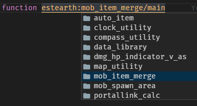

# Datapack Namespacing

## About

There are a few issues with using namespaces regarding the [pack file structure](./structure.md) and follow [Datapack Advancement](https://mc-datapacks.github.io/en/conventions/datapack_advancement.html), this is my recommended technique.

## Multiple packs

**Issue:** Some packs use the `datapack_name` as their namespace.

**Sub Issue:** If you follow Datapack Advancement with defines 3 advancement nodes: `Root`, `Namespace` and `Datapack`.

And because datapack node **must not** be in `/data/global/advancements/folder`. 

Causing the need to take this file to `/data/<namespace>/advancements/`

It became like this `/data/<datapack_name>/advancements/<datapack_name>.json`

### Solution
**Fact:** It's creator name.
```
data
 ├ <namespace> <- It doesn't make sense to set it as datapack_name.
 │    ╰ advancements         
 │        ╰ <datapack_name>.json
 ├ <global>
 │    ╰ advancements
 │        ├ <namespace>.json <- "This is creator_head" * That's why
 │        ╰ root.json
```

**Because:** If creator plan to write more datapacks, it will be very helpful when you work on workspace.



**Result:** `<creator_name>:<datapack_name>` When there are multiple packs, the name on front is to identify who created it and next it to tell what datapack it is. This will be explained further in [Pack file structure](./structure.md)

**Example pack:** All [Boomber360](https://www.planetminecraft.com/member/boomber360/)'s project.

## Standalone pack

That means you can only do 1 pack, not do more, or combine everything in 1 pack.

**Fact:** Completely free with namespaces.
```
data
 ├ <namespace> <- It make sense to set it as datapack_name.
 │    ╰ <...>
 ├ <global>
 │    ╰ advancements
 │        ├ standalone 
 │        │    ╰ <datapack_node>.json <- "This is datapack node" * That's why completely free.
 │        ╰ root.json
```
**Because:** There is no more than 1 pack in your project.

**Result:** `<datapack_name>:<every_internal_function>` When there is 1 pack, which you may name it with, the `creator_name` and `datapack_name` mix or whatever. And everything under that name does not need to be identified. `<datapack_name>`, which makes you know exactly what this pack is, what functionality it comes from and who made it.

**Example pack:** [The Creeper's Code](https://www.planetminecraft.com/data-pack/the-creeper-s-code/)

## Scoreboard

**Issue:** Some packs use the `datapack_name` as their shortened namespace.

**Sub Issue:** Suppose the pack `Bounce block` uses objective as `bb.var`.
Do you see the problem?

What If `bb` is the namespace which is shortened from `boomber`.
That's the problem.

**Advice**: Use namespace shortened from *your name* or *pen name*. If possible, short 2 characters due to 16 characters limitation.

**Fact:** Namespace conflicts can arise. But you can avoid it as much as possible.

**Because:** Static namespaces that are easier to control. Making it possible to eliminate the above problems.

**Result:** In all possibilities, It might give you a limit to tell what the objective is doing. But if managed well, you will be able to use a common objective for many tasks, not including the long-named fake_player scoreboard. If you name the objective well, fake_player will help you here.

**Did you know**: `fake_player` doesn't need to use namespace because it is already inside the objective namespace. `#`~~`ee`~~`.foo.bar ee.data`

## /tag

**Advice**: If possible, include a full name. `tag @s add estearth.foo.bar`

**Because:** It reduces the chance of conflicts from the length of the explicit name.

## Storage

If let me advice, I hope this section will be useful to uninstall.

**Advice**: `estearth:<datapack_name> ee.<path_storage_name>` 

**Because:** If you are using a Namespace, you can remove storage with a single command. Ex.: `data remove storage estearth:<datapack_name> ee`.

**What if:** If it's a standalone pack, an ex. from The Creeper's Code pack is interesting.
`tcc:storage root.<path_storage>`